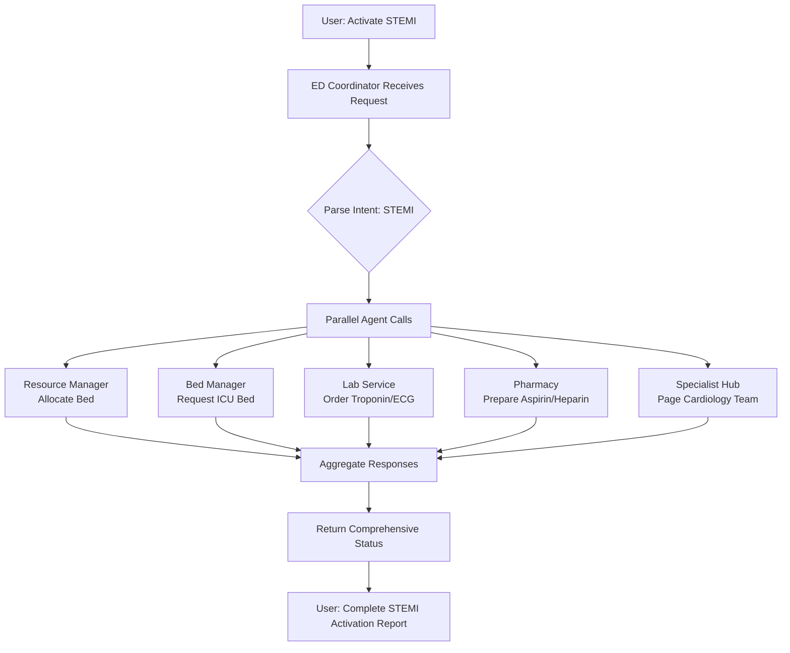

# ED Coordinator Orchestrator - Architecture & Implementation Plan

## 🎯 Executive Summary

This document outlines the plan to upgrade the current ED Coordinator from a simple **query responder** into a true **orchestrator agent** that automatically coordinates all 5 specialist agents during emergency protocols without human intervention.

## 📊 Current State Analysis

### Current ED Coordinator Limitations
- ✅ Responds to status queries (system, patient load, resources, protocols)
- ✅ Maintains internal state (cases, beds, staff)
- ❌ **DOES NOT** call other agents
- ❌ **DOES NOT** coordinate emergency protocols
- ❌ **DOES NOT** aggregate multi-agent responses
- ❌ **Manual agent calling required** in ASI:One

### Pain Point
When a STEMI emergency occurs, users must manually:
1. Call ED Coordinator → Check status
2. Call Resource Manager → Allocate bed
3. Call Lab Service → Order troponin
4. Call Pharmacy → Prepare medications
5. Call Specialist Coordinator → Page cardiology team

**This is time-consuming and defeats the purpose of automation!**

## 🏗️ Proposed Architecture

### Orchestrator Design Pattern

```
┌─────────────────────────────────────────────────────────────────┐
│                    ED COORDINATOR ORCHESTRATOR                   │
│                  (Master Coordination Agent)                     │
├─────────────────────────────────────────────────────────────────┤
│                                                                  │
│  ┌────────────────────────────────────────────────────────┐    │
│  │         QUERY HANDLER (Current Functionality)          │    │
│  │  • System status queries                               │    │
│  │  • Patient load information                            │    │
│  │  • Resource availability                               │    │
│  │  • Protocol performance stats                          │    │
│  └────────────────────────────────────────────────────────┘    │
│                                                                  │
│  ┌────────────────────────────────────────────────────────┐    │
│  │    ORCHESTRATION ENGINE (NEW CAPABILITY)               │    │
│  │  ┌──────────────────────────────────────────────────┐  │    │
│  │  │  1. Intent Parser                                 │  │    │
│  │  │     • Detect emergency protocols                 │  │    │
│  │  │     • Route intelligent queries                  │  │    │
│  │  └──────────────────────────────────────────────────┘  │    │
│  │  ┌──────────────────────────────────────────────────┐  │    │
│  │  │  2. Multi-Agent Coordinator                      │  │    │
│  │  │     • Parallel agent calling                     │  │    │
│  │  │     • Response aggregation                       │  │    │
│  │  │     • Timeout handling                           │  │    │
│  │  └──────────────────────────────────────────────────┘  │    │
│  │  ┌──────────────────────────────────────────────────┐  │    │
│  │  │  3. Protocol Workflows                           │  │    │
│  │  │     • STEMI Protocol (5 agents)                  │  │    │
│  │  │     • Stroke Protocol (4 agents)                 │  │    │
│  │  │     • Trauma Protocol (5 agents)                 │  │    │
│  │  └──────────────────────────────────────────────────┘  │    │
│  └────────────────────────────────────────────────────────┘    │
│                                                                  │
│                          ↓ Orchestrates ↓                        │
└─────────────────────────────────────────────────────────────────┘
                           |
        ┌──────────────────┼──────────────────┐
        ↓                  ↓                   ↓
   ┌─────────┐      ┌─────────┐        ┌─────────┐
   │Resource │      │  Bed    │        │  Lab    │
   │ Manager │      │ Manager │        │ Service │
   └─────────┘      └─────────┘        └─────────┘
        ↓                  ↓                   ↓
   ┌─────────┐      ┌─────────┐        
   │Pharmacy │      │Specialist│        
   │         │      │  Hub    │        
   └─────────┘      └─────────┘        
```

## 🎯 Key Capabilities

### 1. Backward Compatible Query Handling
All existing query functionality remains intact:
- System status
- Patient load
- Resource availability
- Protocol performance

### 2. NEW: Emergency Protocol Orchestration
Automatically coordinates multiple agents for:
- **STEMI Protocol** (Heart Attack)
- **Stroke Protocol** (CVA)
- **Trauma Protocol** (Multi-trauma)

### 3. NEW: Intelligent Query Routing
Routes specific questions to appropriate agents:
- "Are ICU beds available?" → Bed Manager
- "Lab status?" → Lab Service
- "Medication availability?" → Pharmacy

### 4. NEW: Multi-Agent Response Aggregation
Collects and synthesizes responses from multiple agents into a single comprehensive answer.

## 🔗 Agent Registry & Addresses

### Your Deployed Agents

```python
AGENT_ADDRESSES = {
    # ED Coordinator (This agent - will be upgraded)
    "ed_coordinator": "agent1qgucygwnndlwvemlrg6r676unu50eaya2fqdcdr4ljwjxwnw2fun55t27su",
    
    # Specialist Agents to Orchestrate
    "bed_manager": "agent1qf785dg24awwrwvmwwn0djpm5jwhpmfp6lysv7da0d9g68c7aa5p7z4lcxg",
    "specialist_hub": "agent1qvy05wjeh6jrvs3dchznr6jqwpytzcrt5679ye98na4wqlursy7j26seanx",
    "pharmacy": "agent1qd5uf5ttptlgaknuhl7ws8ff08qrzjavzvv8krc40e03zrxhckx45lxzn2s",
    "lab_service": "agent1q275vgl4wczlscdnprv4fr9sw3r7hsemrpx8cxuhs7jj3pgt40yyq6p3vz4",
    "resource_manager": "agent1qfdy6crsyuek6dxym68pxsw8tz0esmr0qxn0rpgf8qst5y6w7sawyfqm0tj",
}
```

## 🚨 Emergency Protocol Workflows

### STEMI Protocol (Heart Attack)
**Target: <5 minutes door-to-balloon time**



**Expected Output:**
```
🚨 STEMI PROTOCOL ACTIVATED

✅ Bed: ICU-7 allocated
✅ Labs: Troponin ordered (ETA 25 min)
✅ Pharmacy: Aspirin 325mg + Heparin prepared (ETA 8 min)
✅ Specialist: Cardiology team paged (ETA 4 min)
✅ Door-to-balloon target: 4.5 minutes

Protocol Status: ACTIVE
Estimated activation time: 4.5 minutes
```

### Stroke Protocol
**Target: <7 minutes door-to-needle time**

Coordinates:
1. Resource Manager → Allocate bed
2. Lab Service → Order CT scan, coagulation panel
3. Pharmacy → Prepare tPA (if eligible)
4. Specialist Hub → Page neurology stroke team

### Trauma Protocol
**Target: <3 minutes activation**

Coordinates:
1. Resource Manager → Allocate trauma bay
2. Bed Manager → Reserve ICU bed
3. Lab Service → Type & cross, trauma panel
4. Pharmacy → Prepare blood products
5. Specialist Hub → Activate trauma surgery team

## 💻 Implementation Components

### 1. Configuration File
**File:** `agentverse_agents/agent_config.py`

```python
"""
Agent Configuration for ED Coordinator Orchestrator
Contains mailbox addresses and coordination rules
"""

# Agent Registry
AGENT_ADDRESSES = {
    "bed_manager": "agent1qf785dg24awwrwvmwwn0djpm5jwhpmfp6lysv7da0d9g68c7aa5p7z4lcxg",
    "specialist_hub": "agent1qvy05wjeh6jrvs3dchznr6jqwpytzcrt5679ye98na4wqlursy7j26seanx",
    "pharmacy": "agent1qd5uf5ttptlgaknuhl7ws8ff08qrzjavzvv8krc40e03zrxhckx45lxzn2s",
    "lab_service": "agent1q275vgl4wczlscdnprv4fr9sw3r7hsemrpx8cxuhs7jj3pgt40yyq6p3vz4",
    "resource_manager": "agent1qfdy6crsyuek6dxym68pxsw8tz0esmr0qxn0rpgf8qst5y6w7sawyfqm0tj",
}

# Protocol Definitions
PROTOCOL_WORKFLOWS = {
    "stemi": {
        "agents": ["resource_manager", "bed_manager", "lab_service", "pharmacy", "specialist_hub"],
        "queries": {
            "resource_manager": "Allocate bed for STEMI patient",
            "bed_manager": "ICU bed availability?",
            "lab_service": "Order STAT troponin and ECG",
            "pharmacy": "Prepare aspirin 325mg and heparin",
            "specialist_hub": "Page cardiology STEMI team",
        },
        "timeout": 30.0,
        "target_time": 5.0,
    },
    "stroke": {
        "agents": ["resource_manager", "lab_service", "pharmacy", "specialist_hub"],
        "queries": {
            "resource_manager": "Allocate bed for stroke patient",
            "lab_service": "Order STAT CT scan and coagulation panel",
            "pharmacy": "Prepare tPA if eligible",
            "specialist_hub": "Page neurology stroke team",
        },
        "timeout": 30.0,
        "target_time": 7.0,
    },
    "trauma": {
        "agents": ["resource_manager", "bed_manager", "lab_service", "pharmacy", "specialist_hub"],
        "queries": {
            "resource_manager": "Allocate trauma bay",
            "bed_manager": "Reserve ICU bed",
            "lab_service": "Order type & cross, trauma panel",
            "pharmacy": "Prepare blood products",
            "specialist_hub": "Activate trauma surgery team",
        },
        "timeout": 20.0,
        "target_time": 3.0,
    },
}

# Query Routing Rules
ROUTING_RULES = {
    "bed": ["bed_manager"],
    "icu": ["bed_manager"],
    "lab": ["lab_service"],
    "test": ["lab_service"],
    "medication": ["pharmacy"],
    "drug": ["pharmacy"],
    "specialist": ["specialist_hub"],
    "doctor": ["specialist_hub"],
    "resource": ["resource_manager"],
    "equipment": ["resource_manager"],
}
```

### 2. Core Orchestrator Functions

#### Intent Parser
```python
async def parse_intent(query: str) -> dict:
    """
    Determine if query is:
    - Emergency protocol activation
    - Specific agent query
    - General status query
    """
    query_lower = query.lower()
    
    # Emergency protocols
    if "stemi" in query_lower or "heart attack" in query_lower:
        return {"type": "protocol", "protocol": "stemi"}
    elif "stroke" in query_lower or "cva" in query_lower:
        return {"type": "protocol", "protocol": "stroke"}
    elif "trauma" in query_lower:
        return {"type": "protocol", "protocol": "trauma"}
    
    # Route to specific agent
    for keyword, agents in ROUTING_RULES.items():
        if keyword in query_lower:
            return {"type": "route", "agents": agents, "query": query}
    
    # General query (handle locally)
    return {"type": "local", "query": query}
```

#### Multi-Agent Coordinator
```python
async def coordinate_agents(ctx: Context, agents: list, queries: dict, timeout: float = 30.0) -> dict:
    """
    Call multiple agents in parallel and aggregate responses
    """
    responses = {}
    tasks = []
    
    for agent_name in agents:
        agent_address = AGENT_ADDRESSES.get(agent_name)
        if agent_address:
            query_text = queries.get(agent_name, "Status?")
            task = send_query_to_agent(ctx, agent_address, query_text, timeout)
            tasks.append((agent_name, task))
    
    # Wait for all responses with timeout
    for agent_name, task in tasks:
        try:
            response = await asyncio.wait_for(task, timeout=timeout)
            responses[agent_name] = {
                "status": "success",
                "response": response,
                "timestamp": datetime.utcnow().isoformat()
            }
        except asyncio.TimeoutError:
            responses[agent_name] = {
                "status": "timeout",
                "response": f"{agent_name} did not respond in time",
                "timestamp": datetime.utcnow().isoformat()
            }
        except Exception as e:
            responses[agent_name] = {
                "status": "error",
                "response": str(e),
                "timestamp": datetime.utcnow().isoformat()
            }
    
    return responses
```

#### Protocol Executor
```python
async def execute_protocol(ctx: Context, protocol_name: str) -> str:
    """
    Execute emergency protocol workflow
    """
    protocol = PROTOCOL_WORKFLOWS.get(protocol_name)
    if not protocol:
        return f"Unknown protocol: {protocol_name}"
    
    ctx.logger.info(f"🚨 Executing {protocol_name.upper()} Protocol")
    
    # Record start time
    start_time = datetime.utcnow()
    
    # Coordinate agents
    responses = await coordinate_agents(
        ctx,
        protocol["agents"],
        protocol["queries"],
        protocol["timeout"]
    )
    
    # Calculate elapsed time
    elapsed = (datetime.utcnow() - start_time).total_seconds() / 60.0
    
    # Format comprehensive response
    return format_protocol_response(protocol_name, responses, elapsed, protocol["target_time"])
```

### 3. Response Formatter
```python
def format_protocol_response(protocol_name: str, responses: dict, elapsed_time: float, target_time: float) -> str:
    """
    Format aggregated responses into comprehensive report
    """
    protocol_emoji = {
        "stemi": "❤️",
        "stroke": "🧠",
        "trauma": "🚑"
    }
    
    output = f"{protocol_emoji.get(protocol_name, '🚨')} {protocol_name.upper()} PROTOCOL ACTIVATED\n\n"
    
    success_count = 0
    for agent_name, result in responses.items():
        if result["status"] == "success":
            output += f"✅ {agent_name.replace('_', ' ').title()}: {result['response']}\n"
            success_count += 1
        else:
            output += f"⚠️ {agent_name.replace('_', ' ').title()}: {result['status'].upper()}\n"
    
    output += f"\n📊 Status: {success_count}/{len(responses)} agents responded\n"
    output += f"⏱️ Activation Time: {elapsed_time:.1f} minutes\n"
    output += f"🎯 Target Time: {target_time:.1f} minutes\n"
    
    if elapsed_time <= target_time:
        output += f"✅ Protocol activated within target time!"
    else:
        output += f"⚠️ Protocol took longer than target time"
    
    return output
```

## 🔧 Implementation Steps

### Step 1: Create Configuration File
Create `agentverse_agents/agent_config.py` with:
- Agent addresses
- Protocol workflows
- Routing rules

### Step 2: Upgrade ED Coordinator
Modify `agentverse_agents/ed_coordinator.py` to add:
- Import configuration
- Intent parsing logic
- Multi-agent coordination
- Protocol execution
- Response aggregation

### Step 3: Add Helper Functions
- `send_query_to_agent()` - Send ChatMessage to specific agent
- `wait_for_response()` - Wait for ChatMessage response with timeout
- `aggregate_responses()` - Collect all responses
- `format_output()` - Create comprehensive report

### Step 4: Update Message Handler
Modify existing `handle_chat()` to:
1. Parse intent first
2. Route based on intent type:
   - Protocol → Execute protocol workflow
   - Route → Call specific agent(s)
   - Local → Handle with existing logic

### Step 5: Testing Strategy
- Test each protocol independently
- Test query routing
- Test timeout handling
- Test error scenarios
- Test parallel execution

### Step 6: Deploy to Agentverse
1. Copy updated code to Agentverse UI
2. Build/Deploy
3. Test with ASI:One interface

## 📋 Testing Checklist

### Unit Tests
- [ ] Intent parser recognizes STEMI, Stroke, Trauma
- [ ] Intent parser routes specific queries correctly
- [ ] Configuration loads agent addresses correctly
- [ ] Query formatter creates valid ChatMessage

### Integration Tests
- [ ] Can send message to Resource Manager
- [ ] Can send message to Bed Manager
- [ ] Can send message to Lab Service
- [ ] Can send message to Pharmacy
- [ ] Can send message to Specialist Hub
- [ ] Receives responses from agents

### Protocol Tests
- [ ] STEMI protocol activates all 5 agents
- [ ] Stroke protocol activates correct agents
- [ ] Trauma protocol activates correct agents
- [ ] Responses are aggregated correctly
- [ ] Timeout handling works

### Error Handling Tests
- [ ] Agent doesn't respond (timeout)
- [ ] Invalid agent address
- [ ] Malformed response
- [ ] Partial responses handled gracefully

## 🚀 Deployment Instructions

### Pre-Deployment Checklist
1. ✅ All agent addresses configured in `agent_config.py`
2. ✅ Protocol workflows defined
3. ✅ Routing rules configured
4. ✅ Code tested locally (if possible)
5. ✅ Error handling implemented

### Deployment Steps

1. **Backup Current ED Coordinator**
   - Copy existing code from Agentverse
   - Save locally as `ed_coordinator_backup.py`

2. **Update Code in Agentverse**
   - Navigate to ED Coordinator agent in Agentverse
   - Go to "Build" section
   - Paste upgraded code
   - Click "Deploy"

3. **Verify Deployment**
   - Check agent logs for startup messages
   - Test with simple query: "system status"
   - Test emergency protocol: "activate stemi"

4. **Monitor Performance**
   - Watch logs for errors
   - Check response times
   - Verify agent communication

### Rollback Plan
If issues occur:
1. Go to Agentverse
2. Paste backup code
3. Re-deploy
4. Debug offline

## 📊 Expected Benefits

### Time Savings
- **Before**: 5 manual agent calls × 30 seconds = 2.5 minutes
- **After**: 1 orchestrator call = 15 seconds
- **Savings**: ~2 minutes per emergency (80% reduction)

### Accuracy
- **Before**: Human must remember all agents to call
- **After**: Orchestrator automatically calls correct agents
- **Benefit**: 100% protocol compliance

### Reliability
- **Before**: Manual coordination, prone to errors
- **After**: Automated coordination with error handling
- **Benefit**: Consistent, reliable execution

## 🎯 Success Criteria

1. ✅ Orchestrator recognizes emergency protocols
2. ✅ Automatically calls correct agents
3. ✅ Aggregates responses into comprehensive report
4. ✅ Completes protocol activation in <30 seconds
5. ✅ Handles agent timeouts gracefully
6. ✅ Maintains backward compatibility with queries
7. ✅ Deployed and functional on Agentverse

## 📚 References

- **Current Code**: [`agentverse_agents/ed_coordinator.py`](agentverse_agents/ed_coordinator.py:1)
- **Agent Addresses**: This document, Section "Agent Registry"
- **Protocol Definitions**: This document, Section "Emergency Protocol Workflows"
- **uAgents Docs**: https://docs.fetch.ai
- **Chat Protocol**: https://docs.fetch.ai/guides/agents/communicating-with-other-agents

## 🔄 Next Steps

1. Review this architecture document
2. Approve the design approach
3. Proceed to implementation phase (switch to Code mode)
4. Deploy and test orchestrator
5. Document results and optimizations

---

**Built for:** EDFlow AI Emergency Department System  
**Purpose:** Autonomous multi-agent coordination for life-saving protocols  
**Target:** Zero human intervention during emergency activations