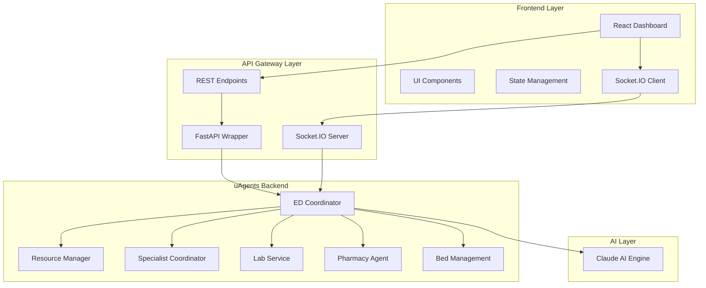
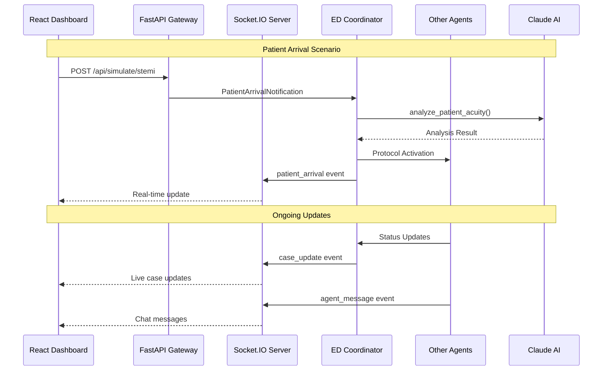
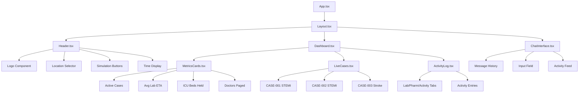
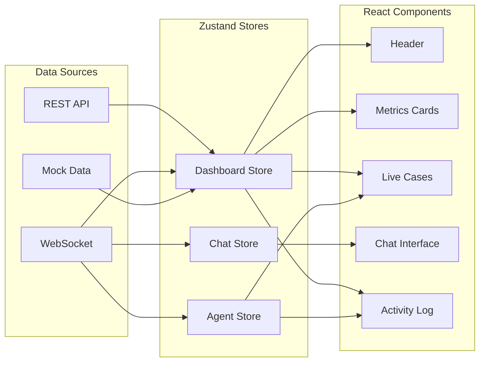
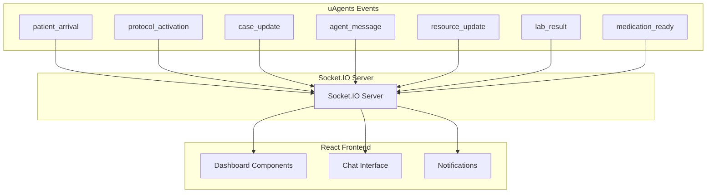
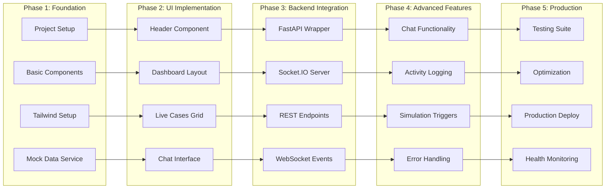

# EDFlow AI System Architecture

## Overall System Architecture

## Real-time Data Flow

## Component Hierarchy

## State Management Flow

## WebSocket Event Flow

## Development Workflow

This architecture ensures a scalable, maintainable, and real-time responsive frontend that seamlessly integrates with the existing uAgents backend system.
