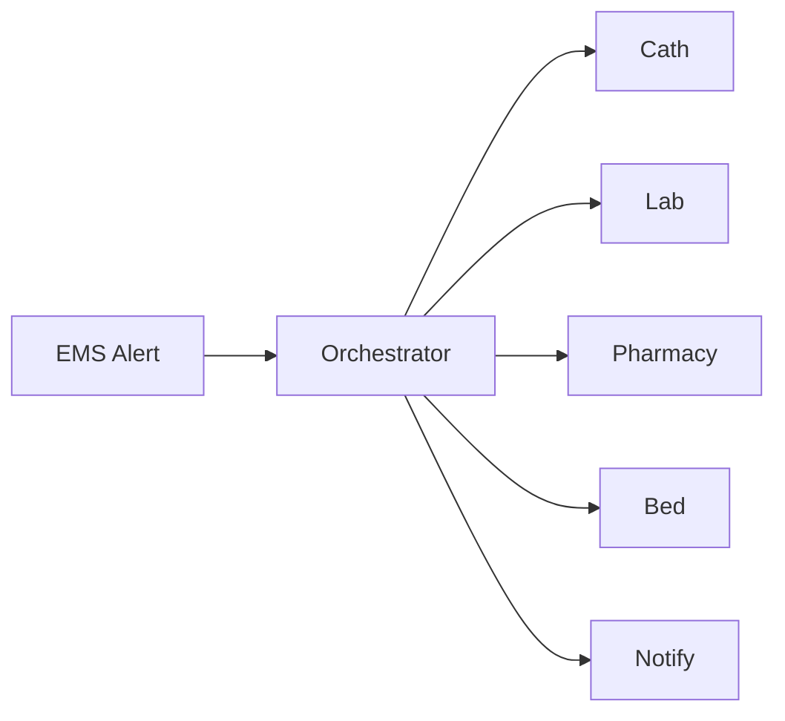

# Architecture (Template)

- Front door: POST `/ems` → Orchestrator (uAgents)
- Fan-out: Orchestrator → Cath/Lab/Pharmacy/Bed/Notify agents
- Read: GET `/cases` → frontend dashboard polling

```mermaid
flowchart LR
  EMS[EMS Alert] --> O[Orchestrator]
  O --> C[Cath]
  O --> L[Lab]
  O --> P[Pharmacy]
  O --> B[Bed]
  O --> N[Notify]
```
