# EDFlow AI - System Architecture

## 🏗️ High-Level Architecture


## 🔄 Agent Communication Flow

### STEMI Patient Scenario


### Multi-Patient Coordination

```mermaid
sequenceDiagram
    participant EMS1 as Ambulance 1<br/>(STEMI)
    participant EMS2 as Ambulance 2<br/>(Stroke)
    participant EMS3 as Ambulance 3<br/>(Trauma)
    participant EDC as ED Coordinator
    participant AI as Claude AI
    participant RSM as Resource Manager

    Note over EMS1,RSM: Concurrent Patient Arrivals

    EMS1->>EDC: STEMI Alert
    EMS2->>EDC: Stroke Alert
    EMS3->>EDC: Trauma Alert

    EDC->>AI: Prioritize & Sequence
    AI-->>EDC: Priority Order: Trauma → STEMI → Stroke

    par Resource Allocation
        EDC->>RSM: Allocate for Trauma
        EDC->>RSM: Allocate for STEMI
        EDC->>RSM: Allocate for Stroke
    end

    RSM-->>EDC: All Resources Allocated
    
    Note over EMS1,RSM: No conflicts - All patients handled concurrently
```



### Resource Conflict Resolution


## 📊 System Components Detail

### 1. Agent Layer (uAgents)

#### ED Coordinator Agent
**Purpose:** Central orchestration and patient flow management

**Capabilities:**
- Receives patient arrival notifications
- Routes to appropriate protocols
- Monitors overall ED status
- Coordinates with all other agents
- Tracks metrics and KPIs

**Message Types:**
- `PatientArrivalNotification`
- `ProtocolActivationRequest`
- `StatusUpdate`
- `MetricsReport`

**Chat Protocol:** ✅ Enabled

---

#### Resource Manager Agent
**Purpose:** Real-time resource allocation and optimization

**Capabilities:**
- Track all ED resources (beds, equipment, rooms)
- Allocate resources based on priority
- Detect and resolve conflicts
- Optimize utilization rates
- Predict resource needs

**Message Types:**
- `ResourceRequest`
- `ResourceAllocation`
- `ConflictNotification`
- `UtilizationReport`

**Performance Target:** <500ms allocation response

**Chat Protocol:** ✅ Enabled

---

#### Specialist Coordinator Agent
**Purpose:** Emergency team activation and coordination

**Capabilities:**
- Maintain specialist availability roster
- Activate appropriate emergency teams
- Coordinate multi-disciplinary responses
- Track team assembly times
- Handle escalations

**Teams Managed:**
- STEMI Team (Interventional Cardiology)
- Stroke Team (Neurology)
- Trauma Team (Surgery)
- Pediatric Team (Pediatrics)

**Message Types:**
- `TeamActivationRequest`
- `TeamStatus`
- `SpecialistAvailability`
- `EscalationAlert`

**Chat Protocol:** ✅ Enabled

---

#### Lab Service Agent
**Purpose:** Laboratory test coordination and tracking

**Capabilities:**
- Process lab orders
- Prioritize urgent tests (Stat, ASAP, Routine)
- Track test status and results
- Send results to relevant agents
- Manage lab capacity

**Test Categories:**
- Cardiac markers (Troponin, BNP)
- Coagulation studies
- Complete blood count
- Chemistry panels

**Message Types:**
- `LabOrder`
- `LabResult`
- `PriorityUpdate`
- `CapacityStatus`

**Chat Protocol:** ✅ Enabled

---

#### Pharmacy Agent
**Purpose:** Medication management and delivery coordination

**Capabilities:**
- Process medication orders
- Check drug interactions
- Verify inventory
- Prioritize urgent medications
- Track delivery status

**Medication Categories:**
- Emergency medications (Epi, Atropine)
- Cardiac medications (tPA, Heparin)
- Pain management
- Antibiotics

**Message Types:**
- `MedicationOrder`
- `InventoryCheck`
- `DeliveryStatus`
- `DrugInteractionAlert`

**Chat Protocol:** ✅ Enabled

---

#### Bed Management Agent
**Purpose:** Optimize bed assignments and turnover

**Capabilities:**
- Track bed status (occupied/available/cleaning)
- Assign beds based on patient needs
- Coordinate bed turnover
- Predict bed availability
- Handle overflow situations

**Bed Types:**
- Trauma bay
- Cardiac monitoring
- Isolation rooms
- General ED beds

**Message Types:**
- `BedRequest`
- `BedAssignment`
- `BedStatusUpdate`
- `TurnoverAlert`

**Target:** 30% improvement in turnover

**Chat Protocol:** ✅ Enabled

---

### 2. LangGraph Orchestration Layer

#### Workflow Orchestrator
**Purpose:** Coordinate multi-agent workflows and state transitions

**Key Functions:**
- Route patients to appropriate protocols
- Manage workflow state
- Coordinate parallel actions
- Handle errors and retries
- Track protocol execution times

**State Graph:**
```
Patient Arrival → Triage → Protocol Selection → Resource Allocation →
Team Activation → Treatment → Monitoring → Discharge/Admit
```

---

#### Emergency Protocols

##### STEMI Protocol
**Target Time:** <5 minutes from door to cath lab activation

**Steps:**
1. ECG acquisition and interpretation (1 min)
2. STEMI confirmation (30 sec)
3. Cath lab activation (1 min)
4. Team assembly (1 min 30 sec)
5. Resource allocation (1 min)

**Success Criteria:**
- Door-to-balloon time: <90 minutes
- Activation time: <5 minutes
- Team response: 100%

---

##### Stroke Protocol
**Target Time:** <7 minutes from door to stroke team activation

**Steps:**
1. NIHSS assessment (2 min)
2. CT scan order (1 min)
3. Stroke team activation (2 min)
4. tPA preparation (1 min 30 sec)
5. Resource allocation (30 sec)

**Success Criteria:**
- Door-to-needle time: <60 minutes
- Activation time: <7 minutes
- CT completion: <25 minutes

---

##### Trauma Protocol
**Target Time:** <3 minutes from alert to trauma bay ready

**Steps:**
1. Pre-arrival notification (30 sec)
2. Trauma bay preparation (1 min)
3. Team activation (1 min)
4. Blood products ready (30 sec)

**Success Criteria:**
- Bay ready: <3 minutes
- Team assembled: <5 minutes
- OR notification: Immediate if needed

---

##### Pediatric Protocol
**Target Time:** <4 minutes from arrival to pediatric team activation

**Steps:**
1. Age-appropriate assessment (1 min 30 sec)
2. Equipment sizing (1 min)
3. Pediatric team activation (1 min)
4. Family support coordination (30 sec)

**Success Criteria:**
- Team activation: <4 minutes
- Appropriate equipment: 100%
- Family support: Initiated immediately

---

### 3. Claude AI Reasoning Engine

#### Patient Acuity Analyzer
**Input:**
- Vital signs (BP, HR, RR, SpO2, Temp)
- Chief complaint
- Symptoms
- Medical history
- Age and demographics

**Output:**
- Acuity score (1-5, ESI scale)
- Recommended protocol
- Risk factors
- Urgency level

**Processing:**
```python
analyze_patient(vitals, symptoms, history) -> {
    "acuity": 1-5,
    "protocol": "STEMI|Stroke|Trauma|Pediatric|General",
    "confidence": 0.0-1.0,
    "risk_factors": [...],
    "recommended_actions": [...]
}
```

**Target Response Time:** <2 seconds

---

#### Resource Optimizer
**Input:**
- Available resources (beds, equipment, staff)
- Current ED load
- Patient requirements
- Time constraints

**Output:**
- Optimal resource allocation plan
- Alternative options
- Predicted bottlenecks

**Optimization Goals:**
- Minimize wait times
- Maximize resource utilization
- Prioritize critical patients
- Balance workload

---

#### Priority Sequencer
**Input:**
- Multiple concurrent patients
- Acuity scores
- Resource availability
- Protocol requirements

**Output:**
- Optimized action sequence
- Time estimates
- Risk assessment

**Sequencing Logic:**
- Life-threatening first (Acuity 1)
- Time-sensitive protocols prioritized
- Resource constraints considered
- Parallel processing maximized

---

#### Conflict Resolver
**Input:**
- Resource conflict details
- Competing priorities
- Available alternatives

**Output:**
- Resolution strategy
- Escalation decision
- Alternative resources

**Resolution Strategies:**
1. Resource reallocation
2. Alternative resource suggestion
3. Timeline adjustment
4. Escalation to human decision-maker

---

## 🔌 Integration Layer

### EHR Connector (HL7/FHIR)
**Purpose:** Bidirectional communication with hospital EHR

**Capabilities:**
- Retrieve patient demographics
- Access medical history
- Update patient records
- Send clinical notes

**Standards:**
- HL7 v2.x for real-time messaging
- FHIR R4 for RESTful API

---

### Lab Information System (LIS)
**Purpose:** Order and receive laboratory tests

**Capabilities:**
- Submit lab orders
- Receive results
- Track test status
- Priority routing

---

### Pharmacy Management System
**Purpose:** Medication ordering and tracking

**Capabilities:**
- Submit medication orders
- Check formulary
- Verify insurance
- Track dispensing

---

### Bed Management System
**Purpose:** Real-time bed status tracking

**Capabilities:**
- Query bed availability
- Reserve beds
- Update bed status
- Track turnover times

---

## 📈 Performance Targets

### Response Times
| Component | Target | Current Status |
|-----------|--------|----------------|
| Agent Communication | <500ms | To be measured |
| AI Decision Making | <2s | To be measured |
| Protocol Activation | Varies by protocol | To be measured |
| STEMI Activation | <5 min | To be measured |
| Stroke Activation | <7 min | To be measured |
| Trauma Activation | <3 min | To be measured |
| Pediatric Activation | <4 min | To be measured |

### System Capacity
| Metric | Target | Notes |
|--------|--------|-------|
| Concurrent Patients | 50+ | With maintained performance |
| Agent Uptime | 99.5% | Agentverse hosting |
| Message Throughput | 1000+/min | Inter-agent messages |
| Protocol Success Rate | >95% | Meeting time targets |

---

## 🔒 Security & Compliance

### HIPAA Compliance
- **Data Encryption:** All patient data encrypted in transit and at rest
- **Access Control:** Role-based access to agents
- **Audit Logging:** All patient interactions logged
- **De-identification:** Demo scenarios use synthetic data

### Agent Security
- **Authentication:** Blockchain-based agent identity
- **Message Verification:** Cryptographic signatures
- **Endpoint Security:** HTTPS only, firewall protected

---

## 🚀 Deployment Architecture

### Development Environment
```
Local Machine
├── Python 3.10+
├── uAgents (local run)
├── LangGraph (local testing)
└── Claude API (cloud)
```

### Production Environment
```
Agentverse Cloud
├── 6+ Hosted Agents
├── 99.5% Uptime SLA
├── Auto-scaling
└── Integrated Monitoring
```

### Network Architecture
```
Internet
    ↓
[Firewall]
    ↓
[Load Balancer]
    ↓
[Agentverse Platform]
    ↓
[Fetch Network]
    ↓
[Agent Endpoints]
```

---

## 📊 Monitoring & Observability

### Metrics Collection
- Agent health checks
- Message latency
- Protocol execution times
- Resource utilization
- Error rates

### Alerting
- Critical patient delays
- Resource conflicts unresolved
- Agent failures
- Performance degradation

### Dashboards
- Real-time ED status
- Protocol performance
- Resource utilization
- Agent communication metrics

---

## 🎯 Success Criteria

### Technical Success
- ✅ 6+ agents deployed on Agentverse
- ✅ Chat protocol enabled on all agents
- ✅ Claude AI integrated and functional
- ✅ <2s AI response times
- ✅ <500ms agent communication
- ✅ Protocol time targets met

### Business Success
- 50% reduction in door-to-balloon time
- 25% reduction in ED length of stay
- 60% reduction in ambulance diversions
- 30% improvement in bed turnover
- 40% reduction in coordination overhead

### Competition Success
- Demonstrates real-world problem solving
- Showcases Fetch.ai ecosystem excellence
- Exceptional user experience
- Novel AI-powered coordination
- Scalable and performant

---

**Architecture designed for competition success! 🏆**